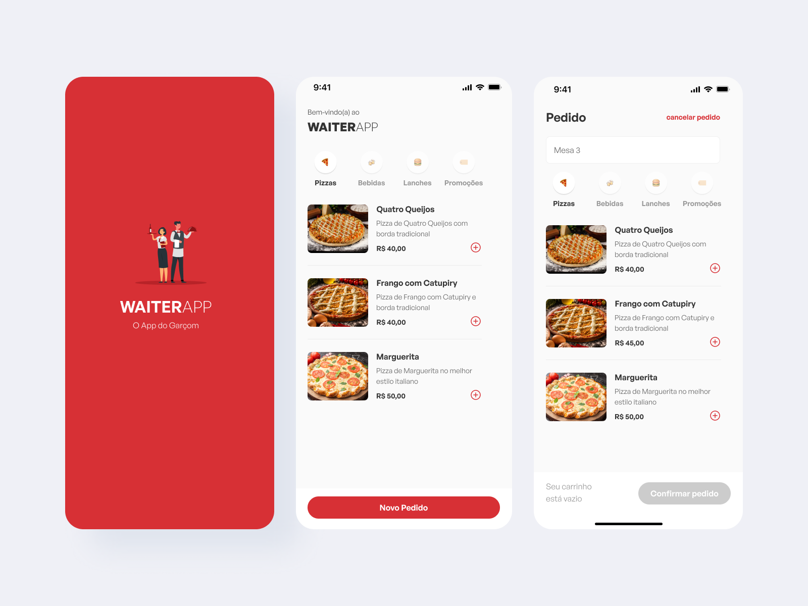

# WaiterApp
 
Anteriormente a pandemia, os **aplicativos de delivery** já demonstravam um características que poderia alterar o **comportamento do consumidor**: a flexíbilidade de solicitar comida para os restaurantes gerou um movimento ainda maior e cada vez mais frequentes de deliverys. E isso provocou um novo perfil de consumo para o **segmento gastronômico**, especialmente para os estabelecimentos físicos.

Contudo, para estar investindo em plataformas de delivery, é necessário que o dono do estabelecimento possua um "capital de giro" considerável, para não sofrer prejuízos, pois, em alguns aplicativos, como o "Ifood" e o "Rappi", as taxas de utilização podem variar em até 25% do preço do produto ([Abrasel](https://abrasel.com.br/revista/mercado-e-tendencias/restaurantes-adotam-sistema-proprio-de-entrega-para-fugir-de-taxas-de-apps/) - 2022). 

A partir da formulação do problema, a proposta de solução é apresentada através do desenvolvimento do aplicativo Waiter”, cujo objetivo principal é a facilitação e a integração, para que o consumidor final possa estar solicitando o seu produto e, em tempo real, as informações que dizem respeito ao pedido serem visualizadas dentro do sistema interno do restaurante.

O sistema irá possuir diversas funcionalidades, dentre elas a possibilidade do cliente final estar realizando a compra de comida a partir do App Mobile, a integração em tempo real dos pedidos dentro do Dashboard do Restaurante.


## Tecnologias Utilizadas

**Client:** React, React Native, Expo, Styled-Components.

**Server:** Node, Express.

**Database:** PostgreSQL.


## API Reference

### Categorias

#### Listar categorias

```bash
  GET /categories
```

#### Criar categoria

```bash
  POST /categories
```

| Parameter | Type     | Description                       |
| :-------- | :------- | :-------------------------------- |
| `icon`      | `string` | **Obrigatório**. Ícone para a categoria |
| `name`      | `string` | **Obrigatório**. Nome para a categoria |

#### Excluir categoria

```bash
  DELETE /categories/:categoryId
```

| Parameter | Type     | Description                       |
| :-------- | :------- | :-------------------------------- |
| `id`      | `string` | **Obrigatório**. Id para encontrar o item |

### Produtos

#### Listar produtos

```bash
  GET /products
```

#### Criar produto

```bash
  POST /products
```

| Parameter | Type     | Description                       |
| :-------- | :------- | :-------------------------------- |
| `imagePath`    | `string` | **Obrigatório**. Arquivo de imagem |
| `name`         | `string` | **Obrigatório**. Nome do Produto |
| `description`  | `string` | **Obrigatório**. Descrição do Produto |
| `price`        | `string` | **Obrigatório**. Preço do Produto |
| `category`     | `string` | **Obrigatório**. Id da Categoria para o Produto |
| `ingredients`  | `string` | **Obrigatório**. Ingredientes do Produto |

#### Obter produto por categoria

```bash
  GET /categories/:categoryId/products
```

| Parameter | Type     | Description                       |
| :-------- | :------- | :-------------------------------- |
| `id`      | `string` | **Obrigatório**. Id da Categoria para encontrar o item |

#### Deletar produto

```bash
  DELETE /products/:productId
```

| Parameter | Type     | Description                       |
| :-------- | :------- | :-------------------------------- |
| `id`      | `string` | **Obrigatório**. Id do item |

### Pedidos

#### Listar pedidos

```bash
  GET /orders
```

#### Criar pedido

```bash
  POST /orders
```

| Parameter | Type     | Description                       |
| :-------- | :------- | :-------------------------------- |
| `table`      | `number` | **Obrigatório**. Número da mesa ou pedido       |
| `products`      | `string` | **Obrigatório**. ID e quantidade do produto      |


#### Alterar status do pedido

```bash
  PATCH /orders/:orderId'
```

| Parameter | Type     | Description                       |
| :-------- | :------- | :-------------------------------- |
| `orderId`      | `number` | **Obrigatório**. ID do pedido       |
| `status`      | `enum` | **Obrigatório**. Status do Pedido - 'WAITING', 'IN_PRODUCTION', 'DONE    |

#### Delete or Cancel order

```bash
  DELETE /orders/:orderId
```

| Parameter | Type     | Description                       |
| :-------- | :------- | :-------------------------------- |
| `id`      | `string` | **Obrigatório**. Id do pedido |

## Screenshots




## Funcionalidades

- Solicitação de Pedidos
- CRUD de Produtos
- Cross platform

## Instalação

Install my-project with npm

```bash
  npm install my-project
  cd my-project
```
    
## Run Locally

Clone the project

```bash
  git clone https://link-to-project
```

Go to the project directory

```bash
  cd my-project
```

Install dependencies

```bash
  npm install
```

Start the server

```bash
  npm run start
```


## Autores

- [@jpprud_](https://github.com/jp-prud)
